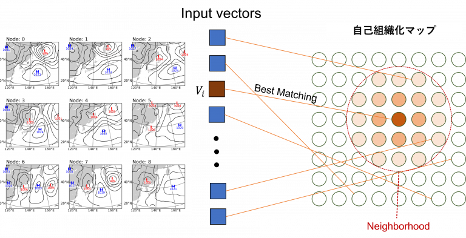
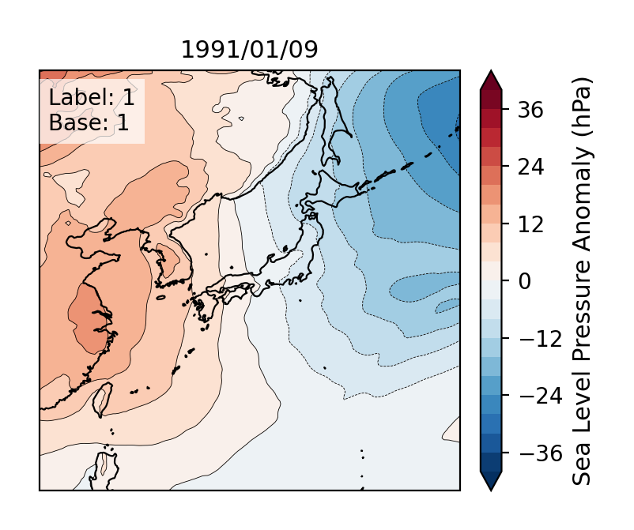
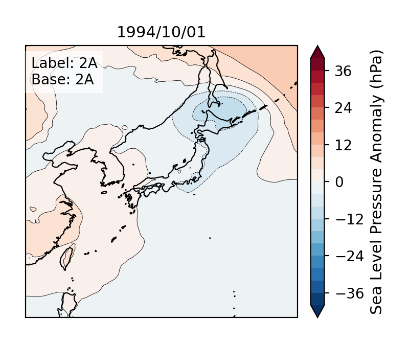
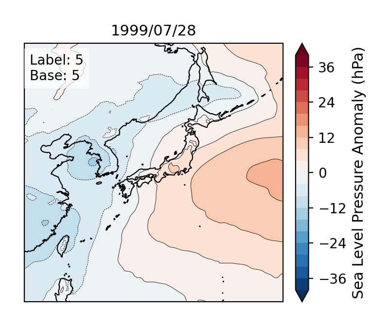
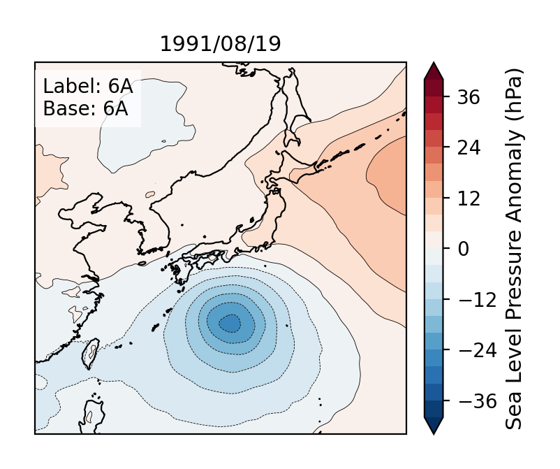

<!-- _class: lead -->

# 構造類似度指標の統合による SOM 気圧配置分類法の一考察

### Synoptic Pattern Classification via Integrated Structural Similarity Metrics in SOM

**高須賀匠**¹ · 高野雄紀 ² · 渡邊正太郎 ³ · 雲居玄道 ¹

¹ 長岡技術科学大学 ² 気象研究所 ³ 株式会社ウェザーマップ

The 48th Symposium on Information Theory and its Applications (SITA2025)
Koriyama, Fukushima, Japan, Nov. 25–28, 2025

---

<!-- _header: 研究背景 -->

## 気圧配置パターン分類の重要性

### なぜ気圧配置分類が必要か？

気圧配置は**気象現象の根本原因**に大きく関わっており，分類から様々なことが分かる：

**🌤️ 気象予報への応用**

- 過去の類似パターンから，天気や大気の状態を統計的に予測
- 異常気象の早期検出

**🌍 気候システムの理解**

- 気候モデルの検証と改善
- 頻出する気圧配置の特定

客観的・自動的な分類手法の確立が急務

---

<!-- _header: 既存手法の課題 -->

## 従来手法の問題点

### 教師あり学習

- 1 つ 1 つ人手でラベル付けするコスト（ノイズが入りやすい）
- ラベルを学習することにより， 分類が主観になる
- 拡張性の限界
- 例：SVM [木村ら， 2009]

### 教師なし学習（SOM）

- ユークリッド距離の限界
- 構造評価の不足
- 解釈性の課題
- 例：従来の SOM 研究

**本研究の着眼点：** 構造類似度指標を SOM に統合する．また，ラベルを用いて大まかに評価を行う

---

<!-- _header: 自己組織化マップ（SOM） -->
<!-- _class: left-table som-5545 -->

## Batch-SOM アルゴリズム

<table class="layout-table" style="width: 100%;">
<tr style="vertical-align: top;">
<td style="width: 60%; text-align: left;">

高次元データを低次元マップに写像する教師なし学習手法

### 学習プロセス

1. **初期化：** $M = m_x \times m_y$ 個のノードを 2 次元格子上に配置
2. **BMU 探索：** 各入力 $x_i$ に対して最良一致ユニット（BMU）を決定  
   $$c(i) = \arg\min_j d(x_i, w_j)$$
3. **近傍関数：** ガウス関数を使用  
   $$h_{c(i),j} = \exp\left(-\frac{\|r_{c(i)} - r_j\|^2}{2\sigma(t)^2}\right)$$
4. **重み更新：** ミニバッチ内で一括更新

距離関数 $d(\cdot, \cdot)$ の選択が学習結果に決定的な影響

</td>
<td style="width: 0%;"></td>
<td style="width: 40%; text-align: right !important; padding-right: 0;">

  

図1，天気図のSOMの動作イメージ

</td>
</tr>
</table>

---

<!-- _header: 従来の距離関数 1/3 -->

## Euclidean（ユークリッド距離）→EU

### 定義

$$d_{\text{EUC}}(x, w) = \sqrt{\sum_{s \in \Omega} (x(s) - w(s))^2 + \epsilon}$$

ここで：

- $x, w$：入力パターンとノード重み（$H \times W$ の格子場）
- $\Omega$：格子領域の添字集合
- $\epsilon = 10^{-12}$：数値安定化の微小正値

### 特徴

- ✅ 値の差の総量を測定
- ✅ 最も基本的で計算が高速
- ❌ 構造や勾配の情報を捉えられない

---

<!-- _header: 従来の距離関数 2/3 -->

## S1（Teweles-Wobus Score）→S1

### 定義

$$d_{\text{S1}}(x, w) = 100 \times \frac{\sum_{i,j} |\Delta_x^x(i,j) - \Delta_x^w(i,j)| + \sum_{i,j} |\Delta_y^x(i,j) - \Delta_y^w(i,j)|}{\sum_{i,j} \max(|\Delta_x^x(i,j)|, |\Delta_x^w(i,j)|) + \sum_{i,j} \max(|\Delta_y^x(i,j)|, |\Delta_y^w(i,j)|) + \epsilon}$$

ここで：

- $\Delta_x^x(i,j) = x(i, j+1) - x(i, j)$：水平方向の一次差分
- $\Delta_y^x(i,j) = x(i+1, j) - x(i, j)$：鉛直方向の一次差分

### 特徴

- ✅ 一次差分（勾配）の相対誤差に基づく
- ✅ 前線帯の鋭さ・広がり・配置の一致を評価
- ✅ 加法定数に不変

---

<!-- _header: 従来の距離関数 3/3 -->

## SSIM5（構造類似度指標）→SS

### 定義

$$d_{\text{SSIM5}}(x, w) = 1 - \frac{1}{|\Omega|} \sum_{s \in \Omega} \frac{4\mu_x(s)\mu_w(s)\sigma_x(s)\sigma_w(s)\text{cov}_{xw}(s)}{(\mu_x(s)^2 + \mu_w(s)^2)(\sigma_x^2(s) + \sigma_w^2(s))(\sigma_x(s)\sigma_w(s)) + \epsilon}$$

ここで：

- $\mu_x(s), \mu_w(s)$：画素 $s$ 近傍（5×5）での局所平均
- $\sigma_x^2(s), \sigma_w^2(s)$：同局所分散
- $\text{cov}_{xw}(s)$：同局所共分散

### 特徴

- ✅ 5×5 局所窓で平均・分散・共分散を計算
- ✅ 明るさ・コントラスト・構造の一致度を測定
- ✅ 人間の視覚認知と整合

---

<!-- _header: 提案手法1 -->

## KAPPA（曲率距離）→KA

### 定義

$$d_{\text{KA}}(x, w) = \frac{1}{2} \times \frac{\sum_{i,j} |\kappa(x)(i,j) - \kappa(w)(i,j)|}{\sum_{i,j} \max(|\kappa(x)(i,j)|, |\kappa(w)(i,j)|) + \epsilon}$$

ここで：

- $\kappa(z) = \nabla \cdot \left(\frac{\nabla z}{\|\nabla z\| + \epsilon}\right)$：正規化勾配の発散（曲率）
- 中心差分で内部共通格子で評価

### 特徴

- ✅ 正規化勾配の発散（曲率）から等圧線の曲がりを評価
- ✅ 高低気圧の閉じた構造を評価
- ✅ 渦度場の特徴を抽出

---

<!-- _header: 提案手法2：複合指標 -->

## RMS 統合による複合手法

異なる物理的意味を持つ距離指標を Root Mean Square（RMS）で統合

$$d_{\text{RMS}} = \sqrt{\frac{1}{n}\sum_{i=1}^n \tilde{d}_i^2}$$

### 提案する複合手法

1. **S1+KAPPA** - 勾配の鋭さ + 曲率 → S1，KA
2. **SSIM5+S1** - 構造 + 勾配の鋭さ → SS，S1
3. **SSIM5+KAPPA** - 構造 + 曲率 → SS，KA
4. **SSIM5+S1+KAPPA** - 構造 + 勾配の鋭さ + 曲率 → SS，S1，KA

行方向min-max正規化により各指標を[0，1]区間に標準化

---

<!-- _header: RMS統合の理論的根拠 -->

## なぜ RMS 統合なのか？

### RMS 統合の利点

1. **スケール不変性** - min-max 正規化により各指標を[0，1]区間に標準化
2. **ユークリッド的統合** - 多次元空間でのユークリッド距離に相当
3. **外れ値への感度** - 算術平均より大きな値に敏感
4. **係数フリー** - 正規化により重み調整が不要

### 行方向 min-max 正規化

$$\tilde{d}(x, w) = \frac{d(x,w) - \min_{w'} d(x,w')}{\max_{w'} d(x,w') - \min_{w'} d(x,w') + \epsilon}$$

入力 $x$ を固定し，全候補 $w'$ に対して正規化することで，候補間の相対的な順位関係に基づく BMU 選択が可能

---

<!-- _header: SOMの分類マップ（従来のCentroid型）の欠点 -->

### SOM の分類後のマップをそのまま見ると...

- ❌ 勾配が平滑化されマップの評価が難しい
  - 特に勾配の激しい低気圧（台風）などが， 影響を受ける

<!-- 2枚横並びの図（キャプション付き） -->
<table class="layout-table" style="width: 100%;">
  <tr style="vertical-align: top;">
    <td style="width: 50%; text-align: center; padding: 0 16px 0 8px;">
      

        
        
図2， S1の学習結果マップ

      

    </td>
    <td style="width: 50%; text-align: center; padding: 0 8px 0 16px;">
      

        
        
図3， S1+KAPPAの学習結果マップ

      

    </td>
  </tr>
</table>

---

<!-- _header: 提案手法3：Medoid表現 -->
<!-- _class: left-table -->

## True Medoid（提案）

<table class="layout-table" style="width: 100%;">
<tr style="vertical-align: top;">
<td style="width: 60%; text-align: left;">

### True Medoid（提案）の利点

- ✅ 実データの鋭さを保持
- ✅ 解釈性の向上
- ✅ それぞれのノードを適切に評価

$$i^* = \arg\min_{i \in I_c} \sum_{j \in I_c} d(X_j, X_i)$$

ノード内総距離が最小となる実サンプルを選択

</td>
<td style="width: 0%;"></td>
<td style="width: 40%; text-align: right !important; padding-right: 0;">

  

  

図4，S1+KAPPAのメドイドマップ

</td>
</tr>
</table>

---

<!-- _header: 実験設定 -->

## 実験設定

### データセット

- **物理量：** 海面更正気圧（SLP）
- **領域：** 日本周辺域（15–55°N， 115–155°E）， 0.25 度間隔
- **期間：** 1991–2000 年（学習：1991–1997，検証：1998–2000），JST 09 時ステップ

### SOM 設定

- **マップサイズ：** 10 × 10
- **反復回数：** 1000，バッチサイズ：128
- **試行回数：** N = 100（シード値 1 ～ 100）

### 評価指標

- **Macro Recall** - 各基本ラベルの再現率の平均
- **NodewiseMatchRate** - ノード多数決と true medoid の一致率

---

<!-- _header: ラベル体系 -->

## 気圧配置ごよみ（基本型 15 種）

1. 西高東低冬型：1

2. 気圧の谷型：2A， 2B， 2C， 2D

3. 移動性高気圧型：3A， 3B， 3C， 3D

4. 前線型：4A（本州上）， 4B（南方）

5. 南高北低夏型：5

6. 台風型：6A， 6B， 6C

吉野（2002）の付録B「気圧配置ごよみ」に準拠

---

<!-- _header: 気圧配置の詳細 1/6 -->

<!-- _class: left-table -->

## 1. 西高東低冬型（1）

<table class="layout-table" style="width: 100%;">
<tr style="vertical-align: top;">
<td style="width: 60%; text-align: left;">

### 特徴

- **シベリア高気圧**と**アリューシャン低気圧**によるもの
- 等圧線が南北に密集し，強い西風が吹く
- 日本海側に大雪，太平洋側は乾燥した晴天

### 気象学的重要性

- 日本の冬季気候を特徴づける最も代表的なパターン
- 季節風（モンスーン）の影響を強く受ける
- 寒気の南下により気温が大きく低下

</td>
<td style="width: 0%;"></td>
<td style="width: 40%; text-align: right !important; padding-right: 0;">

  

図5， 西高東低冬型[1]の天気図（1991-01-09）

</td>
</tr>
</table>

---

<!-- _class: left-table -->
<!-- _header: 気圧配置の詳細 2/6 -->

## 2. 気圧の谷型（2 系：2A ～ 2D）

<table class="layout-table" style="width: 100%;">
<tr style="vertical-align: top;">
<td style="width: 60%; text-align: left;">

### サブタイプと特徴

| サブタイプ |                   特徴                   |
| :--------: | :--------------------------------------: |
|     2A     |              日本海に低気圧              |
|     2B     |             本州南岸に低気圧             |
|     2C     |           日本の東海上に低気圧           |
|     2D     | 二つ玉低気圧（日本海と太平洋側に低気圧） |

### 共通の特徴

- 移動性低気圧の通過に伴う気圧配置
- 前線を伴い，広範囲に降水をもたらす
- 春・秋の季節の変わり目に多く出現

</td>
<td style="width: 0%;"></td>
<td style="width: 40%; text-align: right !important; padding-right: 0;">

  

図6， 気圧の谷型[2A]の天気図（1994-10-01）

</td>
</tr>
</table>

---

<!-- _class: left-table -->
<!-- _header: 気圧配置の詳細 3/6 -->

## 3. 移動性高気圧型（3 系：3A ～ 3D）

<table class="layout-table" style="width: 100%;">
<tr style="vertical-align: top;">
<td style="width: 60%; text-align: left;">

### サブタイプと特徴

| サブタイプ |          特徴          |
| :--------: | :--------------------: |
|     3A     |  高気圧が日本海にある  |
|     3B     |  高気圧が本州上にある  |
|     3C     | 高気圧が日本の東にある |
|     3D     |   高気圧が南方にある   |

### 共通の特徴

- 大陸からの移動性高気圧が日本付近を通過
- 晴天で穏やかな天候をもたらす
- 春・秋の好天日に典型的

</td>
<td style="width: 0%;"></td>
<td style="width: 40%; text-align: right !important; padding-right: 0;">

  

図7， 移動性高気圧型[3A]の天気図（1992-04-06）

</td>
</tr>
</table>

---

<!-- _class: left-table -->
<!-- _header: 気圧配置の詳細 4/6 -->

## 4. 前線型（4 系：4A， 4B）

<table class="layout-table" style="width: 100%;">
<tr style="vertical-align: top;">
<td style="width: 60%; text-align: left;">

### サブタイプと特徴

| サブタイプ |          特徴          |
| :--------: | :--------------------: |
|     4A     | 東西前線が本州上にある |
|     4B     |  前線が南方海上にある  |

### 共通の特徴

- 停滞前線や梅雨前線による気圧配置
- 長期間にわたる降水をもたらす
- 梅雨期（6-7 月）に典型的

### 気象学的重要性

- 日本の雨季を特徴づけるパターン
- 集中豪雨や線状降水帯の発生に関連

</td>
<td style="width: 0%;"></td>
<td style="width: 40%; text-align: right !important; padding-right: 0;">

  

図8， 前線型[4A]の天気図（1993-07-07）

</td>
</tr>
</table>

---

<!-- _header: 気圧配置の詳細 5/6 -->

<!-- _class: left-table -->

## 5. 南高北低夏型（5）

<table class="layout-table" style="width: 100%;">
<tr style="vertical-align: top;">
<td style="width: 60%; text-align: left;">

### 特徴

- **太平洋高気圧**の張り出しによる夏の典型的な気圧配置
- 南から暖かく湿った空気が流入
- 全国的に高温多湿

### 気象学的重要性

- 日本の夏季気候を特徴づけるパターン
- 猛暑日の出現に直結
- 西日本では晴天が続く

</td>
<td style="width: 0%;"></td>
<td style="width: 40%; text-align: right !important; padding-right: 0;">

  

図9， 南高北低夏型[5]の天気図（1999-07-28）

</td>
</tr>
</table>

---

<!-- _class: left-table -->
<!-- _header: 気圧配置の詳細 6/6 -->

## 6. 台風型（6 系：6A ～ 6C）

<table class="layout-table" style="width: 100%;">
<tr style="vertical-align: top;">
<td style="width: 60%; text-align: left;">

### サブタイプと特徴

| サブタイプ |         特徴         |
| :--------: | :------------------: |
|     6A     | 台風が南方海上にある |
|     6B     |     台風が接近中     |
|     6C     |     台風が通過後     |

### 共通の特徴

- 熱帯低気圧（台風）に伴う気圧配置
- 強風・豪雨をもたらす
- 8-10 月に集中

### 気象学的重要性

- 災害をもたらす最も危険なパターン
- 強い渦度と閉じた等圧線が特徴

</td>
<td style="width: 0%;"></td>
<td style="width: 40%; text-align: right !important; padding-right: 0;">

  

図10， 台風型[6A]の天気図（1991-08-19）

</td>
</tr>
</table>

---

<!-- _header: データ分布の詳細 -->

## データセットの特徴

<table class="layout-table" style="width: 100%;">
<tr style="vertical-align: top;">
<td style="width: 48%;">

### 期間別のサンプル数

| 期間                | サンプル数 | 割合   |
| :------------------ | :--------- | :----- |
| 全期間（1991-2000） | 3,653 日   | 100%   |
| 学習期（1991-1997） | 2,556 日   | 約 70% |
| 検証期（1998-2000） | 1,097 日   | 約 30% |

</td>
<td style="width: 4%;"></td>
<td style="width: 48%;">

### ラベル分布の内訳

| カテゴリ       | 件数     | 割合  |
| :------------- | :------- | :---- |
| 基本ラベルのみ | 1,727 件 | 47.3% |
| 複合・移行型   | 1,926 件 | 52.7% |
| 複合型の種類   | 161 種類 | -     |

</td>
</tr>
</table>

### 全期間における基本ラベルの出現数（カテゴリ別）

| カテゴリ | 内容                       | 出現数    | 割合                                                                          |
| :------- | :------------------------- | :-------- | :---------------------------------------------------------------------------- |
| 1        | 西高東低冬型               | 375 件    | 10.3%                                                                         |
| 2 系     | 気圧の谷型（2A ～ 2D）     | 392 件    | 10.7%                                                                         |
| 3 系     | 移動性高気圧型（3A ～ 3D） | 538 件    | 14.7%                                                                         |
| 4 系     | 前線型（4A， 4B）          | 329 件    | 9.0%                                                                          |
| 5        | 南高北低夏型               | 69 件     | 1.9%                                                                          |
| **6 系** | **台風型（6A ～ 6C）**     | **24 件** | 0.7% ← 極端に少ない |

---

<!-- _header: 本実験で用いるラベルデータについて -->

## ラベルデータの信頼性について

### 気圧配置ごよみの特性

**⚠️ 限界**

- 海面更正気圧のみでラベルづけしていない（上層・前線・天気図も考慮）
- 一人の専門家による主観的分類
- 厳格なルールの不在
- 海面更正気圧のみでは精度が 100％になることはない
  - ラベル付きデータはあくまで参考として使用する

**✅ 本研究の立場**

- ノイズを含む教師データからの学習という現実的課題
  - 複合・移行型や微妙なラベルのもの
- 客観的・再現可能な分類手法の確立へ
  - 分類後の SOM マップを見ることで， ノードごとにラベル付可能

---

<!-- _header: 実験のスコア結果：全体性能 -->

## 手法別性能比較（N=100 試行）

| Method                                  | Macro Recall（学習）                 | Macro Recall（検証）                 | NodewiseMatchRate                    |
| :-------------------------------------- | :----------------------------------- | :----------------------------------- | :----------------------------------- |
| S1，KA | 0.372 | 0.223 | 0.284                                |
| S1     | 0.363 | 0.212 | 0.266  |
| SS，S1                                  | 0.336                                | 0.186                                | 0.290                                |
| SS，S1，KA                              | 0.332                                | 0.178                                | 0.276                                |
| SS，KA                                  | 0.325                                | 0.189                                | 0.288                                |
| SS                                      | 0.317                                | 0.175  | 0.284                                |
| EU     | 0.304                                | 0.179                                | 0.312 |
| KA     | 0.297  | 0.208                                | 0.294 |

**青強調**：詳しい考察を行う手法，**黄色強調**：最も高いスコア，**緑**：次点で高いスコア，**赤**：最も低いスコア

S1+KAPPAが学習および検証期で最高の汎化性能を示した， 次点で既存手法である S1

Medoid 一致率では Euclidean が最も高い一致率を示したが，識別性能（Macro Recall）とのトレードオフ

---

<!-- _header: 実験のスコア結果：ラベル別性能（学習期） -->
<!-- _class: flush-left-table -->

## 学習期：全 15 ラベル再現率上位順（全 8 手法， 100 回試行の平均値）

| Method                                  | 1                                   | 2A                                  | 2B                                  | 2C                                  | 2D                                  | 3A                                  | 3B                                  | 3C                                  | 3D                                  | 4A                                  | 4B                                  | 5                                   | 6A                                  | 6B                                  | 6C   |
| :-------------------------------------- | :---------------------------------- | :---------------------------------- | :---------------------------------- | :---------------------------------- | :---------------------------------- | :---------------------------------- | :---------------------------------- | :---------------------------------- | :---------------------------------- | :---------------------------------- | :---------------------------------- | :---------------------------------- | :---------------------------------- | :---------------------------------- | :--- |
| S1，KA | 0.93 | 0.29 | 0.25 | 0.13                                | 0.61 | 0.18                                | 0.77 | 0.05                                | 0.02                                | 0.66 | 0.38 | 0.61 | 0.51 | 0.19                                | 0.00 |
| S1     | 0.91                                | 0.28 | 0.21 | 0.12                                | 0.61 | 0.23                                | 0.78 | 0.05                                | 0.03                                | 0.66 | 0.35 | 0.55 | 0.43 | 0.21 | 0.03 |
| SS，S1                                  | 0.91                                | 0.20                                | 0.13                                | 0.17                                | 0.49                                | 0.26                                | 0.74                                | 0.06 | 0.11                                | 0.60                                | 0.37 | 0.42                                | 0.41                                | 0.18                                | 0.01 |
| SS，S1，KA                              | 0.91                                | 0.05  | 0.06  | 0.18 | 0.54 | 0.31 | 0.70  | 0.11 | 0.21 | 0.58                                | 0.36                                | 0.38                                | 0.44 | 0.16                                | 0.00 |
| SS，KA                                  | 0.94 | 0.11                                | 0.10                                | 0.19 | 0.47                                | 0.25                                | 0.71                                | 0.04  | 0.04                                | 0.59                                | 0.35                                | 0.49                                | 0.36                                | 0.24 | 0.00 |
| SS                                      | 0.91                                | 0.12                                | 0.07                                | 0.19 | 0.43  | 0.21                                | 0.71                                | 0.05                                | 0.13                                | 0.59                                | 0.36                                | 0.43                                | 0.40                                | 0.16                                | 0.01 |
| EU     | 0.91                                | 0.23                                | 0.13                                | 0.05  | 0.47                                | 0.35 | 0.74                                | 0.06 | 0.14 | 0.57  | 0.22  | 0.32  | 0.32                                | 0.05  | 0.00 |
| KA     | 0.88  | 0.22                                | 0.20                                | 0.10                                | 0.46                                | 0.09  | 0.78 | 0.06 | 0.01  | 0.68 | 0.27                                | 0.61 | 0.06  | 0.03                                | 0.00 |

S1+KAPPA は 6 つのラベルで他手法を上回る．また，どの他のラベルの結果も総じてバランスが良い．

---

<!-- _header: 実験のスコア結果：ラベル別性能（検証期） -->
<!-- _class: flush-left-table -->

## 検証期：全 15 ラベル再現率上位順（全 8 手法， 100 回試行の平均値）

| Method                                  | 1                                   | 2A                                  | 2B   | 2C   | 2D                                  | 3A   | 3B                                  | 3C   | 3D   | 4A                                  | 4B                                  | 5                                   | 6A   | 6B   | 6C   |
| :-------------------------------------- | :---------------------------------- | :---------------------------------- | :--- | :--- | :---------------------------------- | :--- | :---------------------------------- | :--- | :--- | :---------------------------------- | :---------------------------------- | :---------------------------------- | :--- | :--- | :--- |
| S1，KA | 0.92 | 0.20 | 0.03 | 0.00 | 0.53 | 0.00 | 0.80                                | 0.00 | 0.00 | 0.71 | 0.08                                | 0.06                                | 0.00 | 0.01 | 0.00 |
| S1     | 0.93 | 0.05                                | 0.01 | 0.00 | 0.55 | 0.01 | 0.78                                | 0.00 | 0.00 | 0.65                                | 0.08                                | 0.08 | 0.00 | 0.03 | 0.00 |
| KA     | 0.90                                | 0.16 | 0.00 | 0.00 | 0.31                                | 0.00 | 0.73  | 0.00 | 0.00 | 0.74 | 0.04                                | 0.22 | 0.00 | 0.00 | 0.00 |
| SS，KA                                  | 0.93 | 0.00  | 0.01 | 0.03 | 0.34                                | 0.00 | 0.79                                | 0.00 | 0.00 | 0.54                                | 0.12 | 0.07                                | 0.00 | 0.00 | 0.00 |
| SS，S1                                  | 0.91                                | 0.00  | 0.00 | 0.00 | 0.31                                | 0.00 | 0.83 | 0.00 | 0.00 | 0.56                                | 0.13 | 0.02                                | 0.00 | 0.03 | 0.00 |
| EU     | 0.86  | 0.04                                | 0.00 | 0.00 | 0.28  | 0.00 | 0.83 | 0.00 | 0.00 | 0.65                                | 0.01  | 0.01  | 0.00 | 0.00 | 0.00 |
| SS，S1，KA                              | 0.88                                | 0.00  | 0.00 | 0.00 | 0.31                                | 0.00 | 0.85 | 0.00 | 0.00 | 0.51  | 0.10                                | 0.01  | 0.00 | 0.00 | 0.00 |
| SS                                      | 0.86  | 0.00  | 0.00 | 0.01 | 0.29                                | 0.00 | 0.78                                | 0.00 | 0.00 | 0.51  | 0.10                                | 0.06                                | 0.00 | 0.01 | 0.00 |

S1+KAPPA はクラス別には他手法と拮抗する場面があるものの，2A の性能では他手法を圧倒した．

---

<!-- _header: 手法の比較検討1：Euclidean vs S1 -->

- ❌ Euclidean の分類マップを見ると，低気圧や高気圧の強さがメドイド代表に出ていない
  - メドイド代表ではないが，S1 では台風らしきノードを表現可能
- ❌ Euclidean はメドイド代表を多く作れているが，S1 に比べてまとまりがない

<!-- 2枚横並びの図（SOMの分類マップの欠点の構図に合わせる） -->
<table class="layout-table" style="width: 100%;">
  <tr style="vertical-align: top;">
    <td style="width: 50%; text-align: center; padding: 0 16px 0 8px;">
      

        
        
図11， Euclideanのメドイドマップ

      

    </td>
    <td style="width: 50%; text-align: center; padding: 0 8px 0 16px;">
      

        
        
図12，S1のメドイドマップ

      

    </td>
  </tr>
</table>

---

<!-- _header: 手法の比較検討2：KAPPA vs S1-->

- ✅ S1 に比べて，KAPPA では南高北低夏型（5）や移動性高気圧（3 系）のノードを多く確立できている
  - 曲率に敏感な KAPPA は，曲率が比較的にない高気圧を読み取るのが上手い
- ❌ KAPPA のメドイド代表は夏か冬ばかりであり，S1 に比べて春秋の情報がマップ上になく表現力がない

<table class="layout-table" style="width: 100%;">
  <tr style="vertical-align: top;">
    <td style="width: 50%; text-align: center; padding: 0 16px 0 8px;">
      

        
        
図13，KAPPAのメドイドマップ

      

    </td>
    <td style="width: 50%; text-align: center; padding: 0 8px 0 16px;">
      

        
        
図14， S1のメドイドマップ

      

    </td>
  </tr>
</table>

---

<!-- _header: 手法の比較検討3：S1+KAPPA vs S1-->

- ✅ S1 に比べてバランスの良いメドイド代表を確立
  - KAPPA の得意な「曲率が比較的にない高気圧を読み取るのが上手い」分野をうまく取り入れている
- ✅ S1+KAPPA は他手法に比べ台風に強く，台風のメドイド代表の作成に成功している

<table class="layout-table" style="width: 100%;">
  <tr style="vertical-align: top;">
    <td style="width: 50%; text-align: center; padding: 0 16px 0 8px;">
      

        
        
図15，S1+KAPPAのメドイドマップ

      

    </td>
    <td style="width: 50%; text-align: center; padding: 0 8px 0 16px;">
      

        
        
図16， S1のメドイドマップ

      

    </td>
  </tr>
</table>

---

<!-- _header: 考察 -->

## 考察：S1+KAPPA の優位性と示唆

- 結論
  - 学習/検証ともに Macro Recall が最良（0.372 / 0.223）．
  - メドイドマップにおいても既存手法に比べて表現力があり，台風ラベルのノードを安定的に出現させることができる．
- 理由
  - S1 は気圧勾配の鋭さと配置，KAPPA は閉じた循環の曲率に敏感という相補性．
  - 行方向 min-max 正規化＋ RMS 統合でスケール差を抑え，特定特徴への過適合を回避．
- 限界
  - 希少クラス（6B/6C）は全手法で低迷．データ稀少性とラベルノイズの影響が大．
  - データの量があるラベルでも特徴が掴めていないラベルがある．（2C, 3A, 3C, 3D）

---

<!-- _header: 結論 -->

## まとめ

### 本研究の貢献

1. ✅ Batch-SOM 上で 8 つの距離指標を厳密比較（100 試行）

2. ✅ S1+KAPPA が勾配と曲率の相補的統合を実現

- 学習 Macro Recall: 0.372 ± 0.019
- 検証 Macro Recall: 0.223 ± 0.017

実運用では S1+KAPPA を標準距離とする構成を推奨

3. ✅ True medoid による解釈性の向上

- 「雪だるま現象」の回避

マクロ平均再現率とメドイドマップにより詳細な解釈が可能

---

<!-- _header: 今後の課題 -->

## Future Work

### 短期的な改善

- 🔧 **多変量拡張** - 複数の気象要素を統合
- 🎯 **詳細な分類** - 大局型（15 タイプ）から複合型・移行型の統合へ

### 運用システムへの実装可能性の検討

🌐 **リアルタイム分類**

1. ノードにおけるラベルの強さも算出・可視化
2. 連続した日時刻の海面更正気圧をそれぞれ分類
3. それぞれの分類されたノードの位置情報から，以下のような時系列情報読み取ることが可能か検証

- 例： ○○ 型の気圧配置ゆるむ
- 例： ○○ 型の気圧配置が崩れ西から気圧の谷接近
- 例： ○○ 型の気圧配置が次第に強まった

---

<!-- _header: 謝辞 -->

## Acknowledgments

### データ提供

- 気象庁 - 海面更正気圧データ
- 吉野正敏博士 - 「気圧配置ごよみ」

### 計算資源

- 長岡技術科学大学 - GPU 計算環境
- 株式会社ウェザーマップ - GPU 計算環境

### 参考文献（抜粋）

- Kohonen (1990) "The self-organizing map"
- Doan et al. (2021) "S-som v1.0: structural self-organizing map"
- Sato & Kusaka (2021) "Statistical inter-comparison of similarity metrics"
- Winderlich et al. (2024) "Classification with modified SSIM"

---

<!-- _class: lead -->

# ご清聴ありがとうございました

**Contact:**
高須賀匠（Takumi Takasuka）
長岡技術科学大学
機械学習理論研究室
s233319@stn.nagaokaut.ac.jp

